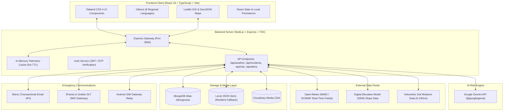

# NER-SAFE 🛡️
### *AI-Powered Multi-Hazard Early Warning & Operational Telemetry System for the North Eastern Region of India*

<div align="center">


<h2>Team Black Bulls</h2>

</div>

### Team Lead & Developer
**Mratunjay Gaur**

**Contributors:**  
- Sajid Ali Ansari
- Yashsav Goyal
- Ayush Yadav
- Poornima K
- TALIN YADAV

---

## 🎥 Demo Video

### NER-SAFE Working Prototype

[▶️ Watch NER-SAFE Demo Video](YOUR_GOOGLE_DRIVE_VIDEO_LINK_HERE)

> The demo video demonstrates the working NER-SAFE platform, including live monitoring, 8-State NER Hub, AI-assisted risk assessment, GIS monitoring, incident reporting, authority monitoring, cross-border weather monitoring, multilingual support, and emergency alerts.

---

[](#sih26001-alignment)
[](https://nodejs.org/)
[](https://react.dev/)
[](https://www.typescriptlang.org/)
[](https://tailwindcss.com/)
[](https://expressjs.com/)
[](https://www.mongodb.com/)
[](https://ai.google.dev/)
[](https://leafletjs.com/)

---

## 📌 Table of Contents

- [Team Black Bulls](#-team-black-bulls)
- [Demo Video](#-demo-video)
- [Overview](#-overview)
- [Problem Statement](#-problem-statement)
- [Our Solution](#-our-solution)
- [Key Features](#-key-features)
- [Application Modules & Views](#-application-modules--views)
- [System Architecture](#-system-architecture)
- [How the System Works](#-how-the-system-works)
- [Technology Stack](#-technology-stack)
- [Data Sources & APIs](#-data-sources--apis)
- [AI & Risk Assessment Methodology](#-ai--risk-assessment-methodology)
- [Database & Storage Architecture](#-database--storage-architecture)
- [Repository Structure](#-repository-structure)
- [Installation & Local Setup](#-installation--local-setup)
- [Environment Variables](#-environment-variables)
- [Screenshots & UI Showcase](#-screenshots--ui-showcase)
- [SIH26001 Alignment](#-sih26001-alignment)
- [Future Scope](#-future-scope)
- [Team & Contributors](#-team--contributors)
- [License](#-license)

---

## 📖 Overview

**NER-SAFE** is a unified, full-stack disaster management and real-time early warning platform engineered specifically for the eight states of the **North Eastern Region (NER) of India** (*Arunachal Pradesh, Assam, Manipur, Meghalaya, Mizoram, Nagaland, Sikkim, and Tripura*).

The platform integrates live meteorological telemetry (rainfall, wind, temperature, humidity, surface pressure), digital elevation model (DEM) slope profiles, volumetric soil moisture data, and verified historical landslide records with **Google Gemini AI** for real-time risk interpretation. It bridges the gap between field incidents and disaster management authorities through GPS-tagged citizen reporting with multimedia evidence, an administrative triage console, transboundary cross-border monitoring for neighboring catchments, and multi-channel emergency alerting (SMS, Email, and CAP-compliant bulletins).

---

## ⚠️ Problem Statement

The North Eastern Region (NER) of India is among the world's most tectonically fragile, geologically young, and hydro-meteorologically volatile zones (Seismic Zones V and IV).

Key challenges addressed by NER-SAFE:

1. **Steep Slopes & High Precipitation**: Extreme monsoonal downpours trigger rapid slope saturation, debris flows, and flash floods that sever strategic highway corridors (e.g., NH-29, NH-10, NH-37).
2. **Data Silos & Delayed Alerts**: Environmental telemetry, satellite soil metrics, and weather warnings often exist in disparate portals, slowing down district-level emergency response.
3. **Transboundary Catchments**: Major river systems (Brahmaputra, Barak, Teesta, Trishuli) originate in neighboring countries (China, Nepal, Bhutan, Myanmar, Bangladesh); upstream cloudbursts or flash floods propagate downstream across borders without unified cross-border situational awareness.
4. **Lack of Ground-Truth Feedback**: First responders and district magistrates lack a verified two-way conduit where citizens can submit geotagged photographic incident reports and receive targeted evacuation warnings in their native languages.

---

## 💡 Our Solution

NER-SAFE unites **meteorological monitoring, geospatial hazard visualization, AI risk synthesis, field incident tracking, and multi-channel alerting** into a single, high-performance operational web application:

```text
[ WMO / ECMWF Live Weather + DEM Slope + Volumetric Soil Moisture ]
                                ↓
                  [ Multi-Factor Landslide Risk Index ]
                                ↓
        [ Google Gemini AI: Geological & Actionable Synthesis ]
                                ↓
        [ Leaflet GIS Layers + Cross-Border Catchment Tracking ]
                                ↓
[ Citizen Geotagged Reports (Cloudinary) ⇄ Authority Triage Console ]
                                ↓
      [ Emergency Alerts: DLT SMS (2Factor) + Email (Brevo) ]
```

---

## 🌟 Key Features

- **Real-Time Weather Telemetry**: Station-grade weather metrics for all 8 NER states and all internal districts (Open-Meteo WMO / ECMWF models with 5-minute server-side caching).
- **8-State NER Hub**: Multi-district matrix monitoring elevation, terrain slope steepness, volumetric soil moisture saturation, and historical landslide event catalogs.
- **Cross-Border Weather & Hazard Corridors**: Dedicated international border monitoring for the 5 nations bordering the NER (**Bangladesh, Bhutan, China, Myanmar, and Nepal**), including the **Bhote Koshi → Trishuli river downstream hazard corridor** (Rasuwa → Nuwakot → Dhading → Chitwan).
- **Gemini AI Risk Assessment**: Dynamic AI reasoning that correlates antecedent rainfall, cumulative saturation, and slope degrees to produce plain-language risk summaries and safety checklists.
- **Interactive GIS Map**: Leaflet-based geospatial visualization featuring road networks, critical infrastructures, incident pins, hazard heatmap layers, and district overlays.
- **Citizen Incident Reporting**: Geotagged report submission with interactive GPS pin selection, severity categorization, and multi-format photo/video upload.
- **Authority Incident Monitor**: Operational triage desk allowing disaster authorities to filter, verify, update lifecycle status (*Reported*, *Verified*, *In Progress*, *Resolved*, *Dismissed*), and review field evidence.
- **Multi-Channel Emergency Alerting**: Immediate broadcast capabilities via Indian DLT-compliant SMS (`2Factor.in`), transactional email alerts (`Brevo`), and local Android SIM hardware gateway integration.
- **Octa-Lingual Accessibility**: Full internationalization (`i18n`) supporting 8 regional languages: **English, Hindi, Assamese (অসমীয়া), Bengali (বাংলা), Khasi (Ka Ktien Khasi), Mizo (Mizo ṭawng), Manipuri (মৈতৈলোন্ / Meiteilon), and Nepali (नेपाली)**.
- **Dual Storage Resilience**: Hybrid database architecture supporting production **MongoDB Atlas** with automated zero-config failover to local persistent JSON storage.

---

## 🖥️ Application Modules & Views

| # | Module / Tab | Purpose & Capabilities |
|---|---|---|
| 1 | **Home** | Executive command dashboard displaying current regional risk level, quick actions, latest alerts, and telemetry overview. |
| 2 | **Live Monitor** | High-precision district-level weather telemetry, 24-hour hourly forecast, 7-day daily forecast, barometric pressure, wind vectors, and UV indices. |
| 3 | **8-State NER Hub** | Comprehensive regional monitoring across all 8 states; displays terrain slope angles, soil saturation (0–100 cm depth), and historical landslide inventories. |
| 4 | **Risk Monitor** | Multi-factor landslide susceptibility index combining rain triggers with slope stability, coupled with server-side Google Gemini AI risk explanations. |
| 5 | **Cross-Border Weather** | International border weather monitoring for the 5 neighboring countries with specialized downstream hazard corridor visualization for Nepal. |
| 6 | **Monitor (GIS)** | Geospatial situational map with toggleable incident layers, road connectivity corridors, risk heatmaps, and coordinate inspection. |
| 7 | **Authority Incident Monitor** | Restricted administrative console for emergency operations centers (EOC) to triage, inspect evidence, filter, and update incident statuses. |
| 8 | **Report Incident** | Public/field portal for submitting geotagged incident reports with media uploads (landslides, flash floods, road blockages, mudslides). |
| 9 | **Send Alert** | Emergency dispatch interface for crafting targeted warnings and broadcasting via SMS, email, and siren alerts. |
| 10 | **Account & Profiles** | Role-based authentication supporting Citizens, Field Responders, and Authorities with OTP verification via email and SMS. |
| 11 | **About NER-SAFE** | Detailed mission documentation, SIH26001 alignment, institutional references (NDMA, GSI, IMD), and data provenance audit. |

---

## 🏗️ System Architecture



---

## ⚙️ How the System Works

1. **Environmental Ingestion**: The Express server periodically queries Open-Meteo's WMO/ECMWF endpoints for coordinates matching districts across the 8 NER states and border stations. Responses are cached with a 5-minute TTL.
2. **Multi-Factor Risk Calculation**: A deterministic risk engine evaluates:
   - **Current & Antecedent Rainfall** (24h to 72h accumulation)
   - **Soil Saturation Index** (volumetric moisture at root/subsurface depths)
   - **Slope Angle & Aspect** from Digital Elevation Model data
   - **Historical Occurrence Factor** in the specific geological sector
3. **AI Interpretation**: When users open the *Risk Monitor*, the system dispatches telemetry to Google Gemini (`gemini-2.5-flash`), which synthesizes the data into plain-language hazard evaluations, trigger mechanics, and localized safety directives.
4. **Community Incident Flow**:
   - A field user or citizen captures evidence of a rockfall or road blockage.
   - Coordinates are automatically resolved via GPS or selected on an interactive map.
   - Media is validated, buffered, and uploaded to Cloudinary CDN.
   - Incident is persisted in MongoDB Atlas (or local store) and flagged as `reported`.
5. **Authority Triage & Warning Dispatch**:
   - EOC operators view new incidents in real time on the *Incident Monitor*.
   - If verified, authorities craft an alert in the *Send Alert* console.
   - The message is dispatched via Brevo Email and 2Factor SMS to registered local contacts.

---

## 💻 Technology Stack

### Frontend

- **Framework**: React 19 (Functional components, Hooks)
- **Language**: TypeScript 5.8
- **Build Tool**: Vite 6.2 with `@vitejs/plugin-react`
- **Styling**: Tailwind CSS 4.1 (`@tailwindcss/vite`)
- **Mapping & GIS**: Leaflet 1.9, `@types/leaflet`
- **Charts & Visualizations**: Recharts 3.10
- **Icons & Animation**: Lucide React (`lucide-react`), Motion (`motion/react`)
- **Localization**: `i18next`, `react-i18next`

### Backend

- **Runtime**: Node.js (v20+) with `tsx` (TypeScript Execute)
- **Framework**: Express 4.21
- **File & Media Handling**: Multer 2.2 (Memory Storage) & Cloudinary SDK 2.11
- **Database ORM**: Mongoose 9.9
- **In-Memory Testing DB**: `mongodb-memory-server` 11.2
- **Email & Communications**: Brevo SDK, Resend, Nodemailer
- **Environment Management**: `dotenv`

### Artificial Intelligence

- **AI SDK**: `@google/genai` (Google Gen AI TypeScript SDK)
- **Model**: Google Gemini 2.5 Flash / Gemini Pro

---

## 🌐 Data Sources & APIs

| Service / Provider | Purpose in NER-SAFE | Authentication Required |
|---|---|---|
| **Open-Meteo (WMO / ECMWF)** | Real-time precipitation, temperature, humidity, wind vectors, pressure, UV index | No (Open Meteorological Data) |
| **SRTM Digital Elevation Model (DEM)** | Terrain slope angle and elevation profiles | Integrated into geospatial calculations |
| **Volumetric Soil Moisture Feeds** | Root zone and deep-soil water saturation (0–100 cm) | Integrated into telemetry engine |
| **Google Gemini API** | Real-time geological risk interpretation and localized advisories | `GEMINI_API_KEY` |
| **Cloudinary** | Secure media evidence hosting (photos/videos of landslides) | `CLOUDINARY_API_KEY`, `SECRET` |
| **Brevo (Sendinblue)** | Transactional email notifications and authentication OTPs | `BREVO_API_KEY` |
| **2Factor.in** | Indian mobile transactional SMS alerts (DLT-compliant) | `TWOFACTOR_API_KEY` |
| **OpenStreetMap & CartoDB** | High-performance cartographic base tiles | Open Access |

---

## 🧠 AI & Risk Assessment Methodology

NER-SAFE employs a **two-tier risk evaluation pipeline**:

### 1. Deterministic Telemetry Indexing

- Evaluates short-term rainfall intensity against geological threshold baselines.
- Weights terrain slope steepness ($>30^\circ$ significantly increases shear stress).
- Factors in subsurface volumetric moisture percentage ($>75\%$ indicates near-complete pore-water pressure saturation).
- Generates a quantified Hazard Level: `LOW`, `MODERATE`, `HIGH`, or `EXTREME`.

### 2. Google Gemini LLM Synthesis (`@google/genai`)

- The quantified metrics, district metadata, and weather forecast are passed in a structured schema to Google Gemini.
- The model acts as an environmental geologist, returning:
  - **Scientific Hazard Summary**: What physical mechanisms are driving current risk.
  - **Vulnerability Breakdown**: Specific hazards to transport lifelines, bridges, and settlements.
  - **Emergency Recommendations**: Actionable instructions for district administrations and citizens.

---

## 🗄️ Database & Storage Architecture

### 1. MongoDB Atlas (`incidents`, `users`, `alert_logs`)

- **Incidents Collection**: Stores title, description, category (`landslide`, `flash-flood`, `road-blocked`, `mudslide`, `other`), severity (`low`, `moderate`, `high`, `extreme`), geographic coordinates (`lat`, `lng`), state, district, media URLs, status (`reported`, `verified`, `in-progress`, `resolved`, `dismissed`), and reporter info.
- **Users Collection**: Stores registered citizens and authorities, roles (`citizen`, `responder`, `authority`), verified phone/email, and preferred language.
- **Alert Logs Collection**: Audits broadcast history, dispatch timestamps, channels used, and recipient counts.

### 2. Resilient Fallback Engine (`localStoreService.ts`)

If MongoDB Atlas is temporarily unreachable or unconfigured during local development, the system seamlessly routes write and read operations to a local file-based JSON store without throwing fatal application errors.

### 3. Media CDN (Cloudinary)

Citizen report uploads are streamed in-memory via Multer directly to Cloudinary's secure cloud storage, returning HTTPS delivery URLs and secure public IDs.

---

## 📂 Repository Structure

```text
.
├── .env.example
├── metadata.json
├── package.json
├── server.ts
├── vite.config.ts
├── tsconfig.json
├── server/
│   ├── db/
│   │   └── connection.ts
│   ├── models/
│   │   ├── Incident.ts
│   │   └── User.ts
│   └── services/
│       ├── localStoreService.ts
│       └── smsService.ts
└── src/
    ├── App.tsx
    ├── main.tsx
    ├── index.css
    ├── components/
    │   ├── Header.tsx
    │   ├── Sidebar.tsx
    │   ├── HomeIntroScreen.tsx
    │   ├── LiveMonitorCommandCenter.tsx
    │   ├── NerHubView.tsx
    │   ├── RiskMonitorView.tsx
    │   ├── CrossBorderWeatherView.tsx
    │   ├── GisMonitorView.tsx
    │   ├── IncidentMonitoringConsole.tsx
    │   ├── ReportIncidentView.tsx
    │   ├── SendAlertView.tsx
    │   ├── crossborder/
    │   └── gis/
    ├── data/
    │   ├── indiaLocations.ts
    │   └── nerHistoricalData.ts
    ├── i18n/
    │   └── locales/
    ├── services/
    ├── types/
    └── utils/
```

---

## 🚀 Installation & Local Setup

### Prerequisites

- **Node.js**: v20.x or higher
- **npm** (v10+) or **bun**
- (Optional) MongoDB Atlas account, Cloudinary account, Brevo/2Factor keys for external services.

### 1. Clone the Repository

```bash
git clone https://github.com/your-username/ner-safe.git
cd ner-safe
```

### 2. Install Dependencies

```bash
npm install
```

### 3. Configure Environment Variables

Copy the example template to create your `.env` file:

```bash
cp .env.example .env
```

Open `.env` and fill in your credentials (see [Environment Variables](#-environment-variables)). If left blank, the application will boot with resilient local fallbacks for evaluation.

### 4. Run Development Server

```bash
npm run dev
```

The server will start at: **`http://localhost:3000`**

### 5. Build for Production

```bash
npm run build
npm start
```

---

## 🔐 Environment Variables

The project uses the following environment variables (template available in `.env.example`):

```env
# 1. DATABASE CONFIGURATION (MongoDB Atlas)
MONGODB_URI=mongodb+srv://<username>:<password>@cluster.mongodb.net
MONGODB_DB_NAME=NER-SAFE

# 2. AI & LARGE LANGUAGE MODEL (Google Gemini)
GEMINI_API_KEY=your_gemini_api_key_here

# 3. MEDIA ASSET STORAGE (Cloudinary)
CLOUDINARY_CLOUD_NAME=your_cloud_name
CLOUDINARY_API_KEY=your_cloudinary_key
CLOUDINARY_API_SECRET=your_cloudinary_secret

# 4. TRANSACTIONAL EMAIL (Brevo / Sendinblue)
BREVO_API_KEY=your_brevo_api_key
BREVO_SENDER_EMAIL=alerts@yourdomain.com
BREVO_SENDER_NAME=NER-SAFE Early Warning

# 5. CITIZEN SMS DISPATCH (2Factor.in)
TWOFACTOR_API_KEY=your_2factor_api_key
TWOFACTOR_SENDER_ID=NERSAF
TWOFACTOR_TEMPLATE_NAME=EmergencyAlert

# 6. AUTHENTICATION & SECURITY
SESSION_SECRET=your_random_session_secret_key

# 7. ANDROID SMS SIM GATEWAY (Optional Hardware Relay)
ANDROID_SMS_GATEWAY_URL=http://your-phone-ip:8080
ANDROID_SMS_GATEWAY_TOKEN=your_gateway_token

# 8. APPLICATION URL
APP_URL=http://localhost:3000
```

> **Note**: Sensitive keys are never committed to version control. The application functions gracefully in offline/local evaluation mode when optional third-party credentials are not set.

---

## 📸 Screenshots & UI Showcase

*(Add your application screenshots in the `assets/` folder to display here)*

| Command Center & Live Telemetry | Risk Monitor & Gemini AI Assessment |
|:---:|:---:|
|  |  |

| Cross-Border Weather & Hazard Corridors | GIS Incident Map & Triage Console |
|:---:|:---:|
|  |  |

---

## 🎯 SIH26001 Alignment

NER-SAFE is directly architected to address **Smart India Hackathon Problem Statement SIH26001**:

1. **Regional Focus on all 8 North Eastern States**: Complete geographic and administrative coverage across Arunachal Pradesh, Assam, Manipur, Meghalaya, Mizoram, Nagaland, Sikkim, and Tripura.
2. **Multi-Factor Trigger Integration**: Fuses meteorological rainfall rates, digital terrain slope models, volumetric soil saturation, and historical landslide catalogs.
3. **Actionable AI Interpretation**: Implements server-side Google Gemini models to translate complex geological telemetry into clear, prioritized advisories.
4. **Closing the Sensor-to-Citizen Loop**: Provides geotagged crowdsourced incident reporting with photo verification alongside instant multi-channel emergency alerting.
5. **Transboundary River Intelligence**: Acknowledges the shared hydrological borders of the NER by monitoring upstream weather and flash-flood hazard corridors in neighboring countries.

---

## 🔮 Future Scope

While the current repository represents a fully functional prototype, planned advancements include:

- [ ] **IoT Geotechnical Sensor Telemetry**: Integration with physical slope inclinometers, piezometers, and pore-pressure sensors deployed along high-risk highway corridors (e.g., NH-10 Sikkim, NH-29 Nagaland).
- [ ] **Automated Satellite SAR Interferometry (InSAR)**: Ingestion of Sentinel-1 / NISAR ground-deformation maps to detect millimeter-scale slope subsidence before catastrophic failure occurs.
- [ ] **NDMA Sachet / CAP XML Integration**: Native protocol compatibility with India's National Disaster Management Authority (NDMA) Sachet Common Alerting Protocol for regional cell broadcasts.
- [ ] **Offline PWA & Mesh Radio Alerts**: Service worker caching and LoRa / Ham-radio packet gateway support for alerting remote villages when cellular internet connectivity fails during disasters.

---

## 👥 Team & Contributors

**Team:** Black Bulls

**Team Lead & Developer:**  
Mratunjay Gaur

**Contributors:**  
- Sajid Ali Ansari
- Yashsav Goyal
- Ayush Yadav
- Poornima K
- TALIN YADAV

---

## 📄 License

This project is licensed under the **MIT License** — see the [LICENSE](LICENSE) file for details. Built for public safety and disaster resilience in the North Eastern Region of India.
